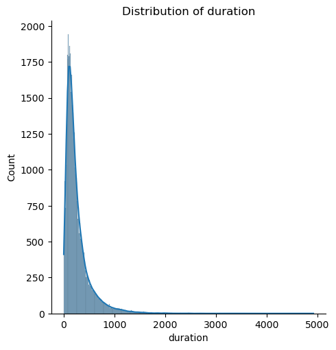

# Practical-Assignment-Module17
repo containing files for third practical assignment for PCMLAI course
### [link to public github repo containing code](https://github.com/mnazers734/Practical-Application-Module17)

## Business Understanding
The goal of this project is to compare the effectiveness of different ML classification techniques in predicting the outcome of multiple direct marketing campaigns performed by a Portuguese bank offering long term deposit applications to it's clients. 

## Notebooks
Two Jupyter Notebooks were used for this project. One was used to analyze the full dataset and one was used to analyze the dataset with a limited number of records. The limited dataset was used to perform GridSearchCV to tune hyperparameters for KNN and SVC models 
[Full Dataset](./prompt_III.ipynb)

[Limited Dataset](./prompt_III.ipynb)

## Data Understanding
After loading the bank-additional-full.csv dataset, the first step in analyzing the data was to identify and remove duplicate records. Initial inspection of the dataset showed there were only 12 duplicated records out of a total of 41189 records. The duplicated records were removed. 

[Link to banking data set used for analysis](./data/bank-additional-full.csv)

[Link to limited banking data set. This was used for performing GridSearchCV](./data/bank-additional.csv)

### Acceptance rate for new banking applications
The table below shows that the overall accpetance rate was 11.26 percent. This lower acceptance rate indicates the dataset is imbalanced. 

<table border="1" class="dataframe">
  <thead>
    <tr style="text-align: right;">
      <th></th>
      <th>success</th>
      <th>percentage</th>
    </tr>
  </thead>
  <tbody>
    <tr>
      <th>no</th>
      <td>36537</td>
      <td>88.733728</td>
    </tr>
    <tr>
      <th>yes</th>
      <td>4639</td>
      <td>11.266272</td>
    </tr>
  </tbody>
  <caption style="caption-side: bottom;">Table showing success rate for campaigns</caption>
</table>

### Numerical Feature Analysis
The dataset only contained two numerical features, customer **age** and **duration** of contact call in seconds. The distribution and box plots for each feature are shown below. The plots show that both features have a slight right skewness however in both cases, the outlier values do not appear to be invalid. Also, there was very low correlation between **age** and **duration** The box plot for **age** indicates a better acceptance rate for older customers. 

  
  

  
  

### Categorical Feature Analysis
Bar plots were created for all categorical features to visualize their distributions. The following plots revealed potentially interesting patterns and insights.

 <h3>As expected, the higher education levels genrally had higher exceptance rates for new banking applications. However, the highest acceptance rates were from the illiterate and unknown categories.</h3> 

 <h3>Students suprisingly had a very high acceptance rate compared to other classes. Retired customers also had higher acceptance rate which could be due to higher disposable income.</h3> 

 <h3>The acceptance rate was highest for customers with 'single' or 'unknown' marital status. This could also be related to the higher number of students who accepted an offer.</h3> 

 <h3>There was a noticably higher acceptance rate when contact was done via cellphone.</h3> 

 <h3>It appears that the acceptance rate goes down based on the number of samples for a given month.</h3> 

### Removing un-needed features
After analyzing the banking dataset, it was decided to remove the **duration and day_of_week** features. As pointed out above, the duration of a call is not known until a potential customer is contacted and at that time the outcome of the interaction is known. Therefore, this is not a good as a predictive input parameter. 

The barchart below shows that the acceptance rate for new programs was very consistent accross all days of the week and no particular day stood out. In order to limit the number of input parameters, this feature was also dropped before creating classification models. 

## ML Data Analysis
<h3>Several Classification Models were trained on the selected parameters using a variety of techniques. The result metrics are shown in the tables below.</h3>
 

<table border="1" class="dataframe">
<caption><h3>Comparison of Basic Classifier Model Scores and training times</h3></caption>
  <thead>
    <tr style="text-align: right;">
      <th></th>
      <th>Model</th>
      <th>Train Time</th>
      <th>Train Accuracy</th>
      <th>Test Accuracy</th>
      <th>Precision</th>
      <th>Recall</th>
      <th>F1</th>
    </tr>
  </thead>
  <tbody>
    <tr>
      <th>logisticregression</th>
      <td>logisticregression</td>
      <td>0.171412</td>
      <td>0.873431</td>
      <td>0.87336</td>
      <td>1.0</td>
      <td>0.0</td>
      <td>0.0</td>
    </tr>
    <tr>
      <th>svc</th>
      <td>svc</td>
      <td>30.823539</td>
      <td>0.874703</td>
      <td>0.871883</td>
      <td>0.304348</td>
      <td>0.009067</td>
      <td>0.01761</td>
    </tr>
    <tr>
      <th>kneighborsclassifier</th>
      <td>kneighborsclassifier</td>
      <td>0.050076</td>
      <td>0.887048</td>
      <td>0.862205</td>
      <td>0.370229</td>
      <td>0.125648</td>
      <td>0.187621</td>
    </tr>
    <tr>
      <th>decisiontreeclassifier</th>
      <td>decisiontreeclassifier</td>
      <td>0.526465</td>
      <td>0.952834</td>
      <td>0.829232</td>
      <td>0.293395</td>
      <td>0.247409</td>
      <td>0.268447</td>
    </tr>
  </tbody>
</table>

<h3>Note: While the training time for KNN was small, the time to fit the model was much longer than other models at around 30 seconds because KNN computes distances between the test sample and all training samples at this time.</h3>
  

<h3>The image above shows the Pipeline used for training KNN models. The Pipelines for other classifiers have a similar structure. The <b>selector</b> applies SelectKMeans to select the top 10 features from the feature set created from the transformer</h3>

<table border="1" class="dataframe">
<caption><h3>Classifier models with feature selection using SelectKBest with K = 10</h3></caption>
  <thead>
    <tr style="text-align: right;">
      <th></th>
      <th>Model</th>
      <th>Train Time</th>
      <th>Train Accuracy</th>
      <th>Test Accuracy</th>
      <th>Precision</th>
      <th>Recall</th>
      <th>F1</th>
    </tr>
  </thead>
  <tbody>
    <tr>
      <th>logisticregression</th>
      <td>logisticregression</td>
      <td>0.288066</td>
      <td>0.873431</td>
      <td>0.87336</td>
      <td>1.0</td>
      <td>0.0</td>
      <td>0.0</td>
    </tr>
    <tr>
      <th>svc</th>
      <td>svc</td>
      <td>16.705736</td>
      <td>0.874703</td>
      <td>0.872375</td>
      <td>0.35</td>
      <td>0.009067</td>
      <td>0.017677</td>
    </tr>
    <tr>
      <th>kneighborsclassifier</th>
      <td>kneighborsclassifier</td>
      <td>0.119971</td>
      <td>0.886063</td>
      <td>0.862533</td>
      <td>0.404624</td>
      <td>0.181347</td>
      <td>0.250447</td>
    </tr>
    <tr>
      <th>decisiontreeclassifier</th>
      <td>decisiontreeclassifier</td>
      <td>0.384931</td>
      <td>0.908908</td>
      <td>0.860072</td>
      <td>0.397468</td>
      <td>0.203368</td>
      <td>0.269066</td>
    </tr>
  </tbody>
</table>

<h3>Several methods for feature selection were tried including manual feature selection, SelectKBest and SelectFromModel (using LogisticRegression and RandomForrest). All methods of feature selection produced similar results with SelectKBest with K=10 producing slightly better results for Precision, Recall and F1 performance metrics. However, these results were not much better than the results for the basic classification models - in some cases the results were slightly worse.</h3>
 

<table border="1" class="dataframe">
<caption><h3>Hyperparameter tuning of classification models using GridSearchCV</h3></caption>
  <thead>
    <tr style="text-align: right;">
      <th></th>
      <th>Model</th>
      <th>Train Time</th>
      <th>Train Accuracy</th>
      <th>Test Accuracy</th>
      <th>Precision</th>
      <th>Recall</th>
      <th>F1</th>
    </tr>
  </thead>
  <tbody>
    <tr>
      <th>logisticregression</th>
      <td>logisticregression</td>
      <td>13.69td>
      <td>0.873431</td>
      <td>0.87336</td>
      <td>1.0</td>
      <td>0.0</td>
      <td>0.0</td>
    </tr>
    <tr>
      <th>svc</th>
      <td>svc</td>
      <td>NA</td>
      <td>NA</td>
      <td>NA</td>
      <td>NA</td>
      <td>NA</td>
      <td>NA</td>
    </tr>
    <tr>
      <th>kneighborsclassifier</th>
      <td>kneighborsclassifier</td>
      <td>NA</td>
      <td>NA</td>
      <td>NA</td>
      <td>NA</td>
      <td>NA</td>
      <td>NA</td>
    </tr>
    <tr>
      <th>decisiontreeclassifier</th>
      <td>decisiontreeclassifier</td>
      <td>8.80</td>
      <td>0.906</td>
      <td>0.858</td>
      <td>0.382</td>
      <td>0.193</td>
      <td>0.256</td>
    </tr>
  </tbody>
</table>

<h3>The table above shows that hyper-parameter tuning using GridSearchCV did not greatly improve performance for classification models. <b>Note:</b>KNeighborsClassifier and SVC GridSearchCV could not be completed on full dataset due to excessive runtime. The process was repeated on the limited dataset bank-additional.csv. The results for the limited dataset are in the table below.</h3>

<table border="1" class="dataframe">
<caption><h3>Hyperparameter tuning using GridSearchCV for limited dataset</h3></caption>
  <thead>
    <tr style="text-align: right;">
      <th></th>
      <th>Model</th>
      <th>Train Time</th>
      <th>Train Accuracy</th>
      <th>Test Accuracy</th>
      <th>Precision</th>
      <th>Recall</th>
      <th>F1</th>
    </tr>
  </thead>
  <tbody>
    <tr>
      <th>Logistic Regression</th>
      <td>Logistic Regression with GridSearchCV</td>
      <td>1.854049</td>
      <td>0.891732</td>
      <td>0.891219</td>
      <td>1.0</td>
      <td>0.0</td>
      <td>0.0</td>
    </tr>
    <tr>
      <th>SVC</th>
      <td>SVC with GridSearchCV</td>
      <td>251.704651</td>
      <td>0.891732</td>
      <td>0.891219</td>
      <td>1.0</td>
      <td>0.0</td>
      <td>0.0</td>
    </tr>
    <tr>
      <th>KNN</th>
      <td>KNN with GridSearchCV</td>
      <td>1.338213</td>
      <td>0.910761</td>
      <td>0.878113</td>
      <td>0.321429</td>
      <td>0.108434</td>
      <td>0.162162</td>
    </tr>
    <tr>
      <th>Decision Tree</th>
      <td>Decision Tree with GridSearchCV</td>
      <td>1.384992</td>
      <td>0.956037</td>
      <td>0.861075</td>
      <td>0.328358</td>
      <td>0.26506</td>
      <td>0.293333</td>
    </tr>
  </tbody>
</table>

<h3>The table above shows that hyper-parameter tuning using GridSearchCV using the dataset with limited number of records (approx one tenth of full dataset). This produced the best F1 score for any trained models. The score was .293 for the Decision Tree Classifier.</h3>

<table border="1" class="dataframe">
  <thead>
  <caption><h3>Varying threshold for KNN model</h3></caption>
  <thead>
    <tr style="text-align: right;">
      <th></th>
      <th>accuracy</th>
      <th>precision</th>
      <th>recall</th>
      <th>f1</th>
    </tr>
  </thead>
  <tbody>
    <tr>
      <th>0.0</th>
      <td>0.126640</td>
      <td>0.126640</td>
      <td>1.000000</td>
      <td>0.224811</td>
    </tr>
    <tr>
      <th>0.1</th>
      <td>0.483432</td>
      <td>0.168480</td>
      <td>0.782383</td>
      <td>0.277255</td>
    </tr>
    <tr>
      <th>0.2</th>
      <td>0.719324</td>
      <td>0.244698</td>
      <td>0.582902</td>
      <td>0.344696</td>
    </tr>
    <tr>
      <th>0.3</th>
      <td>0.857776</td>
      <td>0.414414</td>
      <td>0.297927</td>
      <td>0.346647</td>
    </tr>
    <tr>
      <th>0.4</th>
      <td>0.857776</td>
      <td>0.414414</td>
      <td>0.297927</td>
      <td>0.346647</td>
    </tr>
    <tr>
      <th>0.5</th>
      <td>0.865814</td>
      <td>0.439153</td>
      <td>0.215026</td>
      <td>0.288696</td>
    </tr>
    <tr>
      <th>0.6</th>
      <td>0.873852</td>
      <td>0.521127</td>
      <td>0.047927</td>
      <td>0.087782</td>
    </tr>
    <tr>
      <th>0.7</th>
      <td>0.874180</td>
      <td>0.647059</td>
      <td>0.014249</td>
      <td>0.027883</td>
    </tr>
    <tr>
      <th>0.8</th>
      <td>0.874180</td>
      <td>0.647059</td>
      <td>0.014249</td>
      <td>0.027883</td>
    </tr>
    <tr>
      <th>0.9</th>
      <td>0.873524</td>
      <td>1.000000</td>
      <td>0.001295</td>
      <td>0.002587</td>
    </tr>
  </tbody>
</table>

<h3>As a final test, the threshold levels for positive output was varied between 0 and 1. The metric scores were calculated for each threshold. This method produced the best F1 score of all other training attempts with a value of .3467</h3>

## Results and Recommendations
The EDA of the customer acceptance for long-term deposit applications through direct marketing campaigns by a Portuguese bank revealed the following insights:
  With an overall acceptance rate of 11.26% across 41,189 records, the dataset was imbalanced. Key trends showed that older customers exhibited higher acceptance rates, while education level correlated positively with acceptance, particularly among those with higher education. Retired individuals and students had higher acceptance rates. Additionally, single individuals also showed higher acceptance rates, which could be due to the greater proportion of students in this group. Suprislingly, the mode of contact affected the acceptance rate, with cellphone communications having a notably increased acceptance rate than traditional phone calls. Seasonal variations were observed with very high acceptance rates observed in months that also had lower overall contacts. This should be looked into for future programs. 

Because the dataset was unbalanced, the F1 score was used to rate the trained models over accuracy. Several classification models were tested, including Logistic Regression, SVM, KNN, and Decision Trees using different training techniques. While feature selection techniques like SelectKBest with K=10 slightly improved model performance, the F1 score remained modest, possibly due to the dataset's imbalance. Hyperparameter tuning using GridSearchCV again showed marginal gains, with the Decision Tree model achieving the best F1 score of 0.293 on a reduced dataset. The overall best F1 score was achieved by varying the probability threshold for the positive outcome from the KNN model trained using feature selection. This produced an F1 score of .3467. These results underscore the need for advanced methods to improve recall and better predict customer acceptance.

